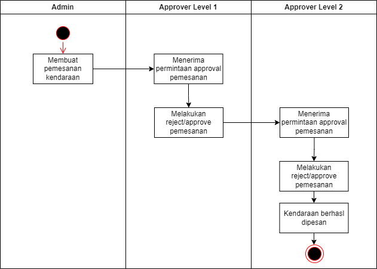

# Project Name: Sekawan FS

## Table of Contents

- [Project Name: Sekawan FS](#project-name-sekawan-fs)
  - [Table of Contents](#table-of-contents)
    - [Notes](#notes)
    - [System Requirements](#system-requirements)
    - [Setup Instructions](#setup-instructions)
    - [User Credentials](#user-credentials)
    - [Database Configuration](#database-configuration)
    - [Used Frameworks](#used-frameworks)
    - [Application Usage Guide](#application-usage-guide)
    - [Activity Diagram](#activity-diagram)

---

### Notes

Hi,

Thank you for considering me for this opportunity. I wanted to mention that I wasn’t able to fulfill all the project requirements due to some gaps in my current PHP skills, as I haven’t worked in that environment recently. I fully understand if this affects my consideration, but if given the opportunity, I’m committed to quickly catching up and contributing my best.

Thank you for your understanding.

Best regards,

Arya Wibowo Jati

---

### System Requirements

-   **PHP Version**: 8.2 or higher
-   **Database Version**: PostgreSQL 14 or compatible version
-   **Node.js**: 20 or higher
-   **Composer**: 2.0 or higher

---

### Setup Instructions

1. **Clone the Repository**:

    ```bash
    git clone <repository-url>
    cd <project-folder>
    ```

2. **Install Dependencies**:

    ```bash
    composer install
    npm install
    ```

3. **Environment Setup**:
   Copy the example environment file and generate the application key:

    ```bash
    cp .env.example .env
    php artisan key:generate
    ```

4. **Database Migration and Seeding**:
   Configure your database settings in the `.env` file, then run migrations and seeders:

    ```bash
    php artisan migrate --seed
    ```

5. **Run the Application**:
    ```bash
    php artisan serve
    npm run dev
    ```

---

### User Credentials

| Name                    | Email                 | Password       | Role     | Approval Level |
| ----------------------- | --------------------- | -------------- | -------- | -------------- |
| System Admin            | admin@example.com     | securepassword | admin    | 0              |
| Level 1 Approver        | approver1@example.com | securepassword | approver | 1              |
| Level 2 Approver        | approver2@example.com | securepassword | approver | 2              |
| Second Level 1 Approver | approver3@example.com | securepassword | approver | 1              |
| Second Level 2 Approver | approver4@example.com | securepassword | approver | 2              |

---

### Database Configuration

-   **Database Engine**: PostgreSQL 14 or compatible
-   **Default Connection Settings**:
    -   **DB_HOST**: 127.0.0.1
    -   **DB_PORT**: 5432
    -   **DB_DATABASE**: sekawanfs_db
    -   **DB_USERNAME**: root
    -   **DB_PASSWORD**: (your password)

---

### Used Frameworks

-   Backend: Laravel
-   Frontend: Intertia.js (React) with TailwindCSS and DaisyUI

---

### Application Usage Guide

After successfully setting up the project, you can access it via:

-   **Local Development Server**: [http://127.0.0.1:8000](http://127.0.0.1:8000)

To start the development environment, use the following command:

```bash
php artisan serve
npm run dev
```

or

```bash
composer run dev
```

---

### Activity Diagram


